

# PA4 Submission: TaskFlow Pipeline

Copy this file to <code style="color:#111827;background:#ddd6fe;padding:2px 4px;border-radius:4px;">SUBMISSION.md</code>. Put every screenshot in <code style="color:#111827;background:#ddd6fe;padding:2px 4px;border-radius:4px;">docs/</code>, embed it under the correct task, and write a short description below each image explaining what it proves. The grader should not need any file outside this repository.

## Student Information

| Field | Value |
|---|---|
| Name | TODO |
| Roll Number | TODO |
| GitHub Repository URL | https://github.com/Dannyism11/CS487-PA4 |
| Resource Group | `rg-sp26-27100326` |
| Assigned Region | `ukwest` |

## Evidence Rules

- Use relative image paths, for example: ``.
- Every image must have a 1-3 sentence description below it.
- Azure Portal screenshots must show the resource name and enough page context to identify the service.
- CLI screenshots must show the command and output.
- Mask secrets such as function keys, ACR passwords, and storage connection strings.

## Task 1: App Service Web App (15 points)

### Evidence 1.1: Forked Repository

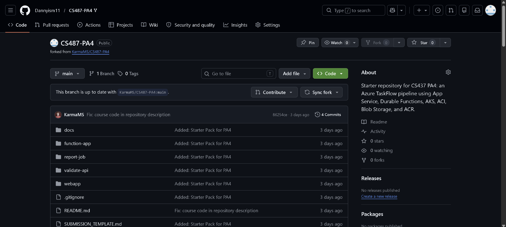

Description: Working fork of `KarmaMS/CS487-PA4` at `Dannyism11/CS487-PA4` containing the PA4 starter structure (`docs/`, `function-app/`, `report-job/`, `validate-api/`, `webapp/`, README and submission template). Branch `main` is up to date with the upstream repository.

### Evidence 1.2: App Service Overview

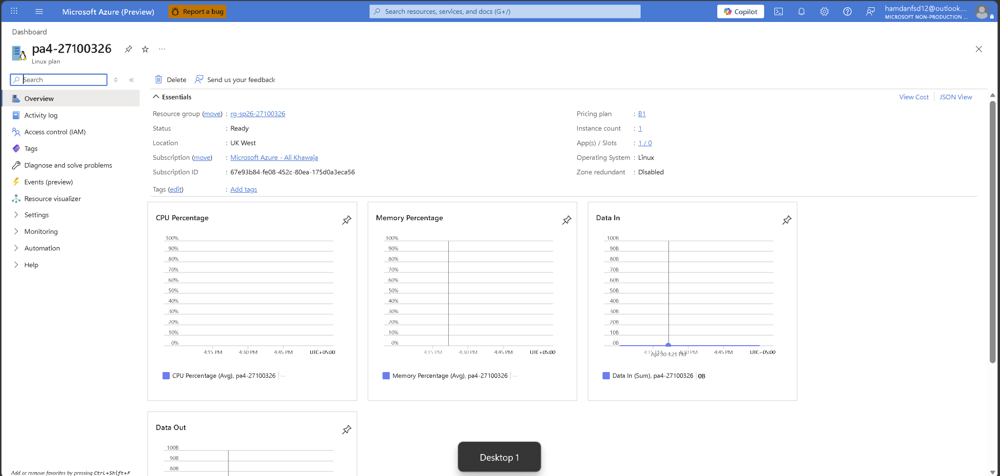

Description: Web App `pa4-27100326` on Linux App Service Plan, located in **UK West**, in resource group `rg-sp26-27100326`, status **Ready**, B1 pricing tier. The Overview blade also displays the live CPU, Memory, Data In, and Data Out charts.

### Evidence 1.3: Deployment Center / GitHub Actions

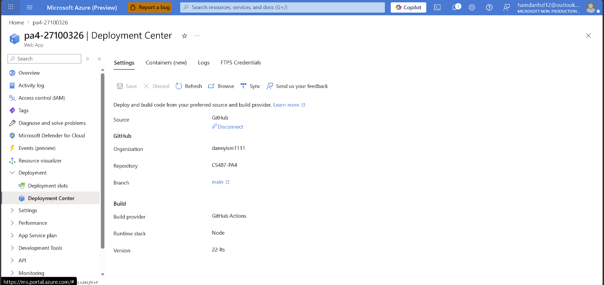

Description: Deployment Center for `pa4-27100326` showing **Source = GitHub**, Organization `dannyism1111`, Repository `CS487-PA4`, Branch `main`, Build provider **GitHub Actions**, Runtime stack **Node 22-lts**. This wires the Web App to the forked repository for continuous deployment.

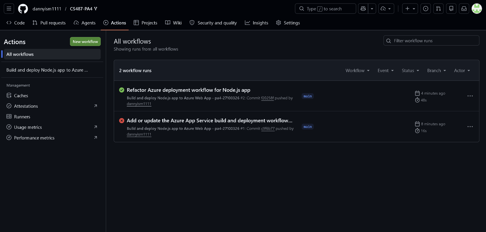

Description: GitHub Actions "All workflows" view in the fork showing the deploy-to-Azure workflow. The most recent run "Refactor Azure deployment workflow for Node.js app" succeeded (green check) and built/deployed the webapp to `pa4-27100326`.

### Evidence 1.4: Live Web UI

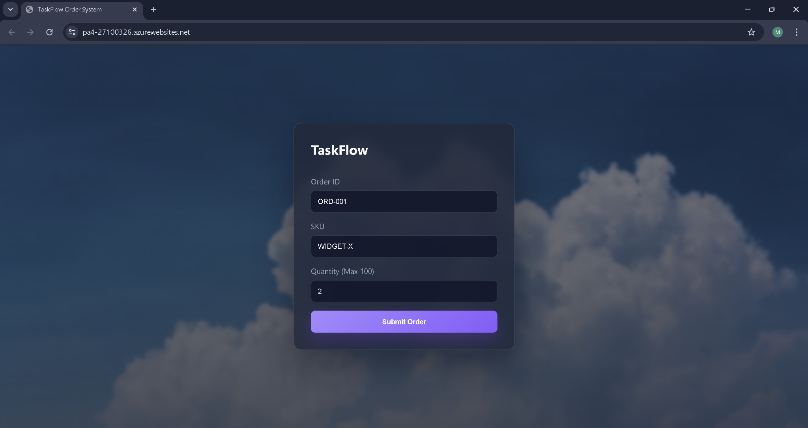

Description: TaskFlow order form loaded from `https://pa4-27100326.azurewebsites.net` showing Order ID, SKU, and Quantity (Max 100) inputs and a Submit Order button. Confirms the App Service is serving the frontend successfully.

> The two screenshots below were also captured during Task 1 work and appear in the original docx for completeness:

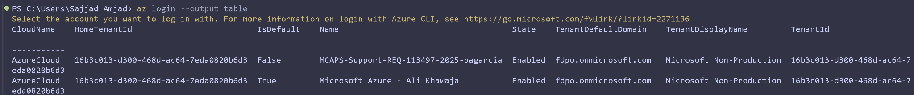

Description: `az login --output table` confirming the active Azure subscription **Microsoft Azure - Ali Khawaja** that hosts every resource referenced in this submission.

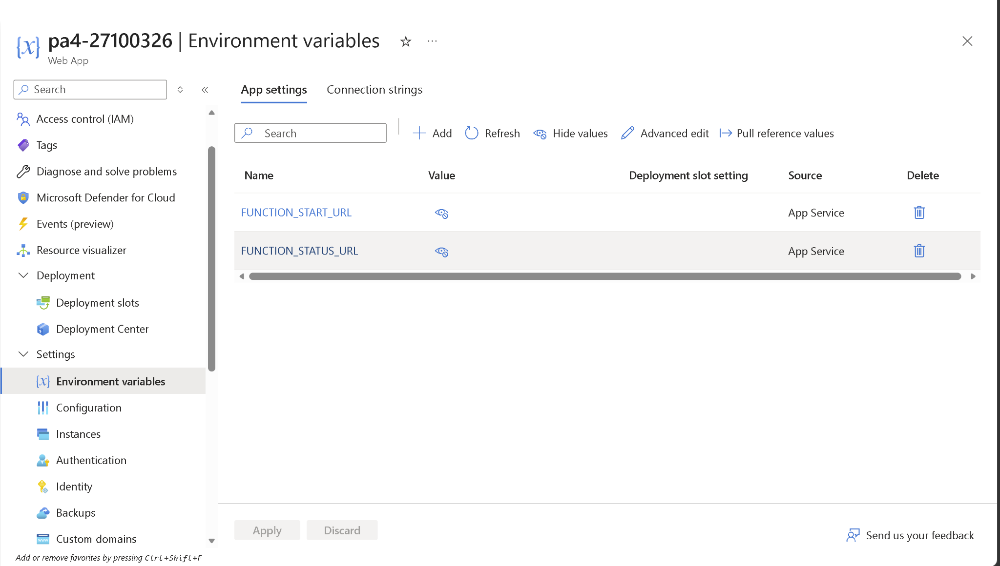

Description: Environment variables blade for the Web App, listing the `FUNCTION_START_URL` and `FUNCTION_STATUS_URL` app settings (values masked) that will be wired to the Durable Function in Task 7.

---

## Task 2: Azure Container Registry (15 points)

### Evidence 2.1: ACR Overview

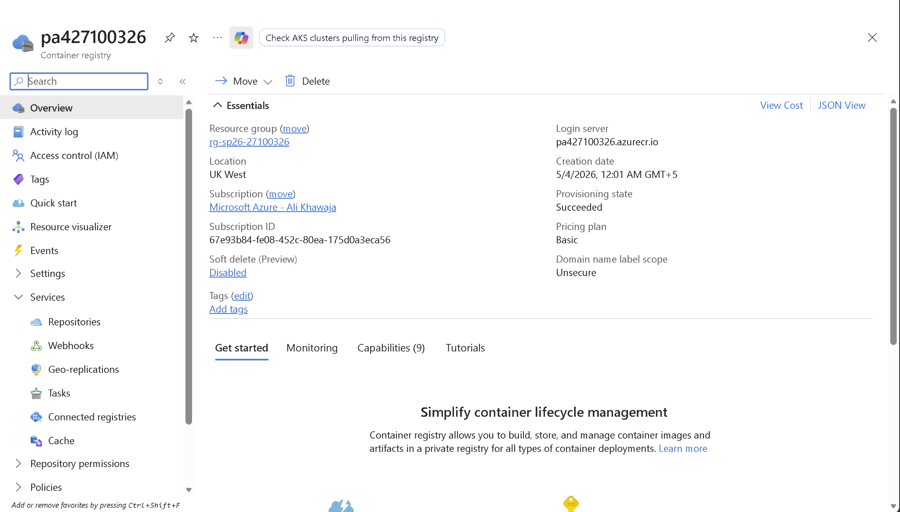

Description: Container Registry `pa427100326` in resource group `rg-sp26-27100326`, region **UK West**, **Basic** pricing plan, Login server `pa427100326.azurecr.io`, Provisioning state Succeeded.

### Evidence 2.2: Docker Builds

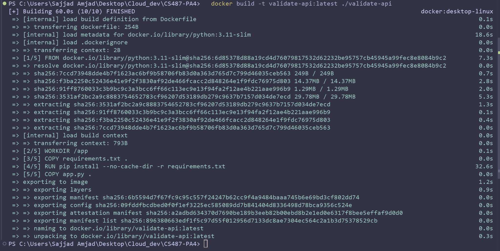

Description: `docker build -t validate-api:latest ./validate-api` finishing successfully against the `validate-api/` folder (Python 3.11-slim base, `pip install -r requirements.txt`, manifest exported).

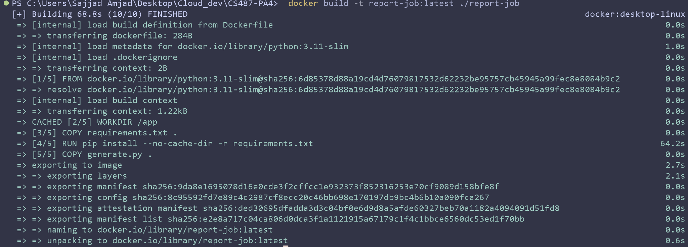

Description: `docker build -t report-job:latest ./report-job` finishing successfully against the `report-job/` folder, producing the image used by the ACI report worker in Task 6.

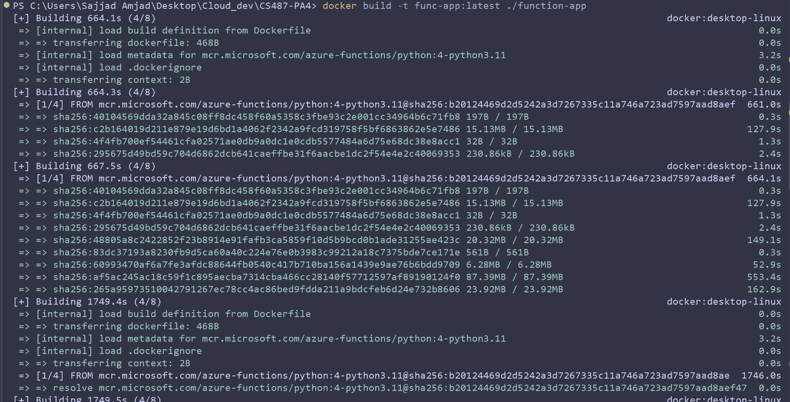

Description: `docker build -t func-app:latest ./function-app` finishing successfully against the `function-app/` folder using the `mcr.microsoft.com/azure-functions/python:4-python3.11` base image.

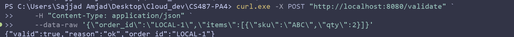

Description: Quick local sanity check — `curl -X POST http://localhost:8080/validate` against the validate-api container returns `{"valid":true,"reason":"ok","order_id":"LOCAL-1"}`, confirming the image works before pushing to ACR.

### Evidence 2.3: ACR Repositories

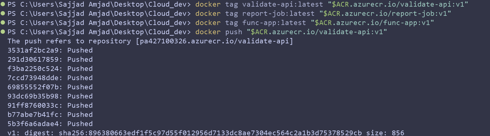

Description: All three local images tagged with the `pa427100326.azurecr.io/...:v1` registry prefix, then `docker push` for `validate-api:v1` succeeds (digest `sha256:8963…29cb`).

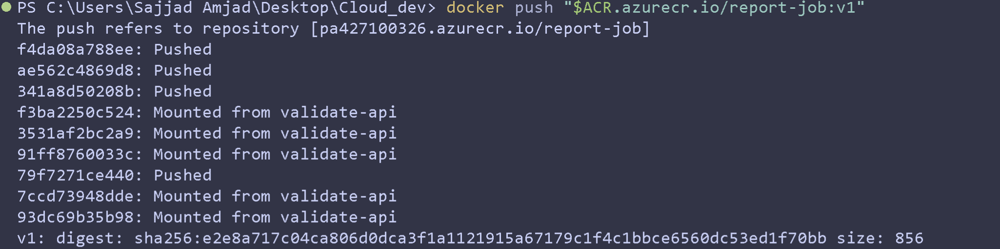

Description: `docker push pa427100326.azurecr.io/report-job:v1` succeeds, with several layers mounted from `validate-api` (shared base) and the new layers pushed (digest `sha256:e2e8…0bb`).

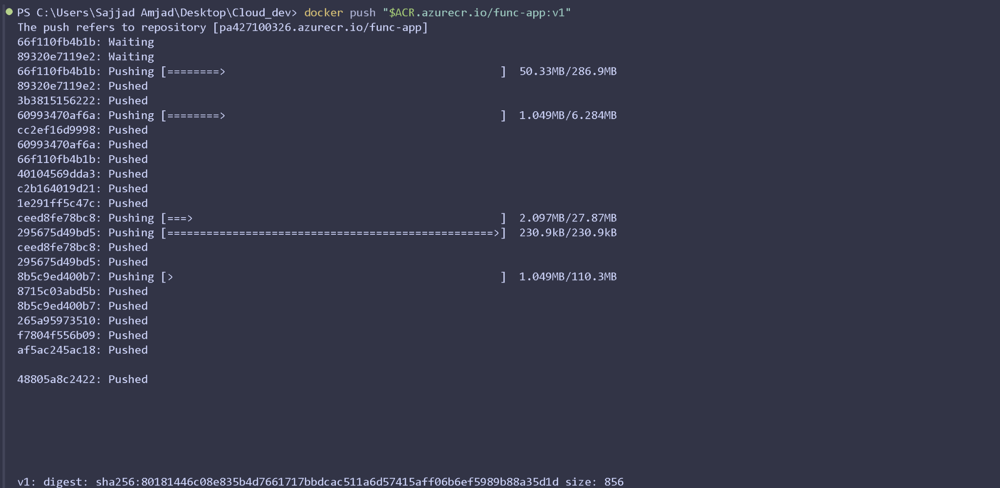

Description: `docker push pa427100326.azurecr.io/func-app:v1` succeeds, completing the trio. After this step the registry holds `validate-api:v1`, `report-job:v1`, and `func-app:v1` — the three images consumed by AKS, ACI, and Function App respectively.

---

## Task 3: Durable Function Implementation (12 points)

### Evidence 3.1: Completed Function Code

See [`function-app/function_app.py`](function-app/function_app.py) in the fork.

Description: The orchestrator chains `validate_activity` (HTTP call to the AKS validator at `VALIDATE_URL`) and, on a positive validation, `report_activity` (creates an ACI from `report-job:v1` with the order ID and storage details) into a single Durable Functions sequence kicked off by the `http_starter` HTTP trigger.

### Evidence 3.2: Local Function Handler Listing

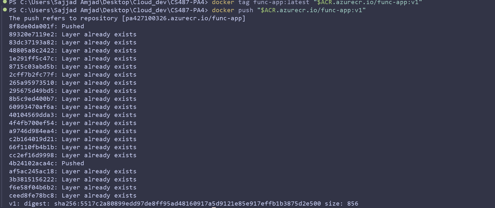

Description: `docker tag func-app:latest "$ACR.azurecr.io/func-app:v1"` followed by `docker push` succeeds with digest `sha256:5517…d2e500`. This proves the Durable Functions image (with the HTTP starter, orchestrator, and activity handlers compiled in) was built and pushed to ACR ahead of the Function App container deployment in Task 4. *(The screenshot of `func start` showing handler discovery was not captured locally; the equivalent Azure-side handler listing is included as Evidence 4.x below where the portal shows `http_starter`, `key_orchestrator`, and `report_activity` discovered.)*

---

## Task 4: Function App Container Deployment (8 points)

### Evidence 4.1: Function App Container Configuration

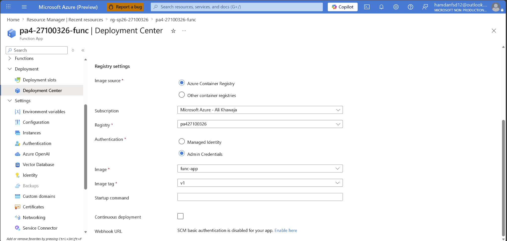

Description: Deployment Center for the Function App `pa4-27100326-func` showing **Image source = Azure Container Registry**, Registry `pa427100326`, Image `func-app`, Image tag `v1`, Authentication **Admin Credentials**. The Function App is therefore running my custom `func-app:v1` image from ACR.

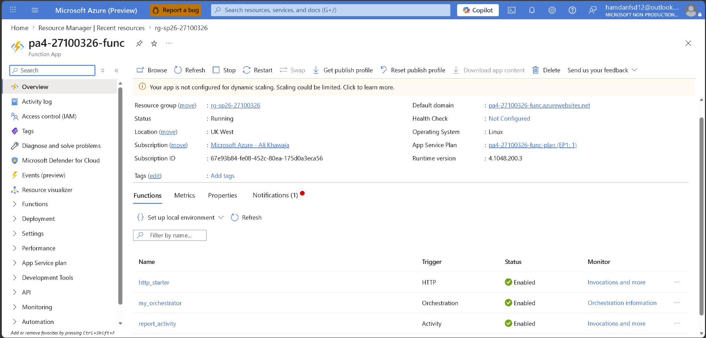

Description: Function App `pa4-27100326-func` Overview tab showing all three handlers discovered by the Durable Functions runtime — `http_starter` (HTTP trigger, Enabled), `key_orchestrator` (Orchestration trigger, Enabled), `report_activity` (Activity trigger, Enabled). Status **Running**, Linux, Runtime version 4.1041.200.3.

### Evidence 4.2: Orchestration Smoke Test

TODO: Embed screenshot of the `curl` output that starts an orchestration and returns status URLs.

Description: TODO: Explain what the returned `id` and `statusQueryGetUri` prove. *(Not captured in the original docx — please add a `curl -X POST .../api/orchestrators/...` screenshot here.)*

### Evidence 4.3: Expected Failed Status Before Downstream Wiring

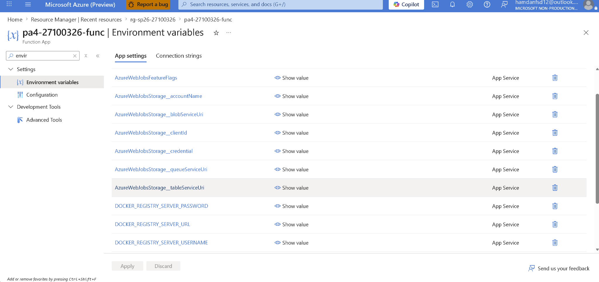

Description: Function App application settings at the stage shown — the storage and Docker registry settings (`AzureWebJobsStorage*`, `DOCKER_REGISTRY_SERVER_*`) are populated but downstream pointers like `VALIDATE_URL` are still absent. Any orchestration started at this point would have failed at the validate step, which is the expected behavior before Task 5 is wired.

---

## Task 5: AKS Validator (15 points)

### Evidence 5.1: AKS Cluster

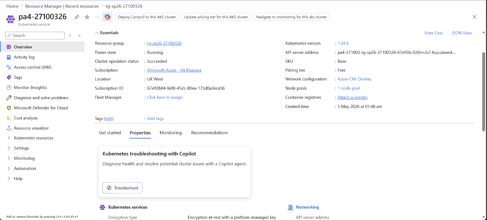

Description: AKS cluster `pa4-27100326` in resource group `rg-sp26-27100326`, **UK West**, Kubernetes version 1.34.6, **1 node pool**, Power state **Running**, Cluster operation status **Succeeded**, Pricing tier **Free**, Network configuration Azure CNI Overlay.

### Evidence 5.2: Kubernetes Nodes and Pods

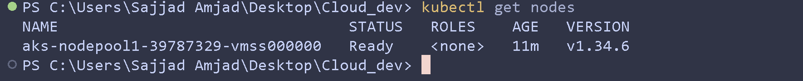

Description: `kubectl get nodes` shows `aks-nodepool1-39787329-vmss000000` in **Ready** state, age 11m, Kubernetes 1.34.6 — the single AKS worker node is healthy.

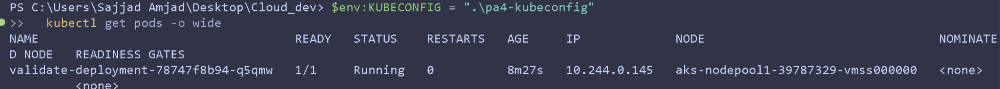

Description: `kubectl get pods -o wide` shows `validate-deployment-78747f8b94-q5qmw` **1/1 Running**, restarts 0, age 8m27s, scheduled on `aks-nodepool1-39787329-vmss000000` with pod IP `10.244.0.145`. The validator pod is healthy on the cluster node from 5.1.

### Evidence 5.3: Kubernetes Service

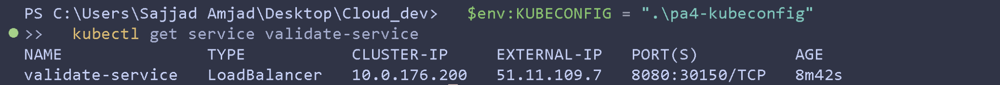

Description: `kubectl get service validate-service` shows TYPE **LoadBalancer**, CLUSTER-IP `10.0.176.200`, **EXTERNAL-IP `51.11.109.7`**, port mapping `8080:30150/TCP`. This is the public endpoint the Durable Function will hit.

### Evidence 5.4: Validator API Tests

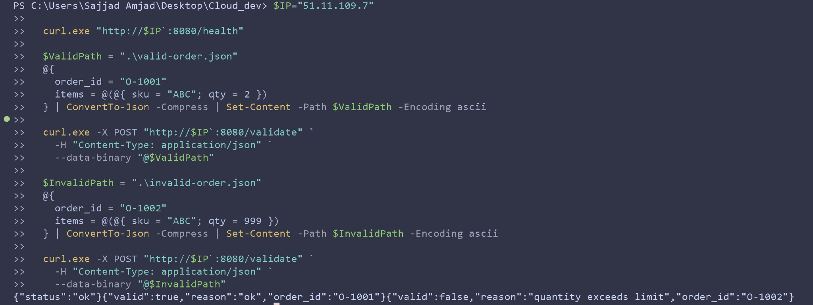

Description: Three CLI tests against `http://51.11.109.7:8080`. (1) `/health` returns OK. (2) Valid order `O-1001` with `qty=2` returns `{"status":"ok","valid":true,"reason":"ok","order_id":"O-1001"}`. (3) Invalid order `O-1002` with `qty=999` is rejected with `{"valid":false,"reason":"quantity exceeds limit","order_id":"O-1002"}` — the `qty > 100` rule is enforced.

### Evidence 5.5: Function App `VALIDATE_URL`

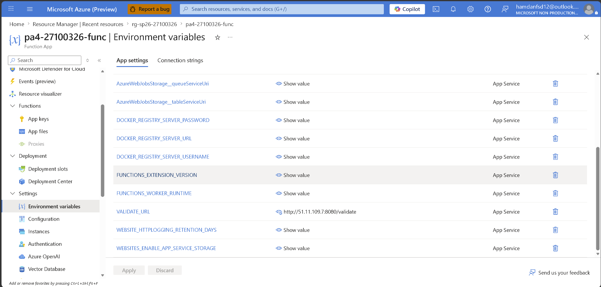

Description: Function App `pa4-27100326-func` Environment variables blade with `VALIDATE_URL = http://51.11.109.7:8080/validate` (matches the EXTERNAL-IP from 5.3). The Durable orchestrator now has a working pointer to the AKS validator.

### Evidence 5.6: AKS Idle Behavior

TODO: Embed AKS metrics screenshot and/or `kubectl` output after the service is idle.

Description: TODO: Explain that the AKS node remains running even when there are no orders. *(Not captured in the original docx — please add an idle-state metrics screenshot here.)*

---

## Task 6: ACI Report Job (15 points)

### Evidence 6.1: Blob Container

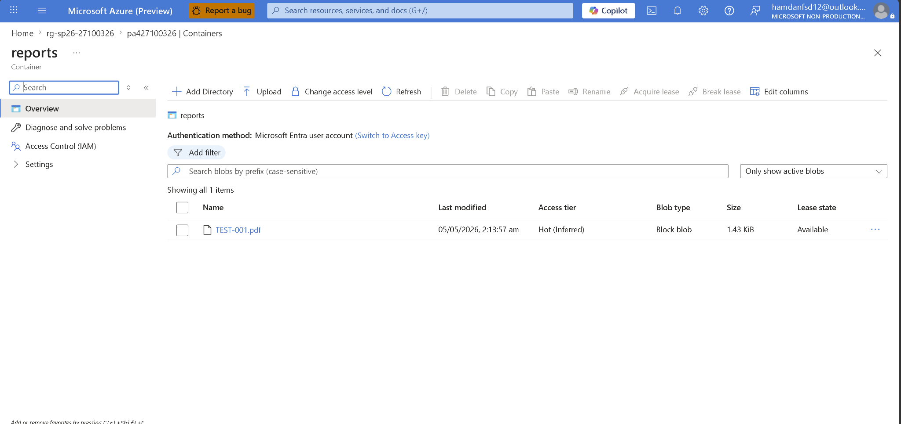

Description: Storage account `pa427100326` → `reports` blob container, listing `TEST-001.pdf` (1.41 KiB, Hot tier, Available) — generated PDF reports land here.

### Evidence 6.2: Manual ACI Run

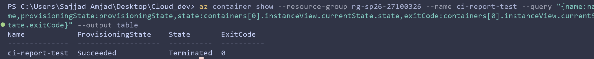

Description: `az container show --resource-group rg-sp26-27100326 --name ci-report-test --query "{name:name, provisioningState:provisioningState, state:containers[0].instanceView.currentState.state, exitCode:containers[0].instanceView.currentState.exitCode}"` returns ProvisioningState **Succeeded**, State **Terminated**, ExitCode **0**. The job is one-shot — it runs to completion and exits cleanly.

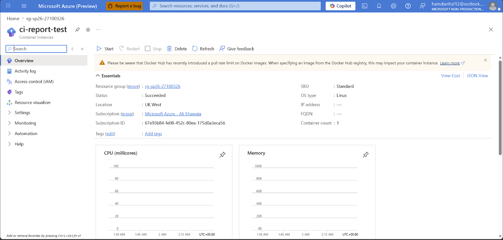

Description: Container Instance `ci-report-test` in `rg-sp26-27100326` — Status **Succeeded**, Location **UK West**, OS type **Linux**, Container count **1**. CPU and Memory charts confirm the container ran briefly and exited.

### Evidence 6.3: ACI Logs

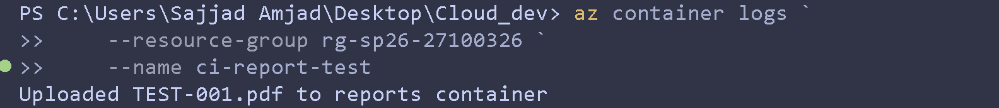

Description: `az container logs --resource-group rg-sp26-27100326 --name ci-report-test` prints `Uploaded TEST-001.pdf to reports container`, confirming the report job successfully generated the PDF and wrote it to Blob Storage before exiting.

### Evidence 6.4: Generated PDF

Description: Same `reports` blob container view as 6.1, here serving as proof that `TEST-001.pdf` was actually written by the ACI job — the timestamp on the blob aligns with the `ci-report-test` exit time, demonstrating the write path ACI → Blob works end-to-end.

### Evidence 6.5: Function App Managed Identity and IAM

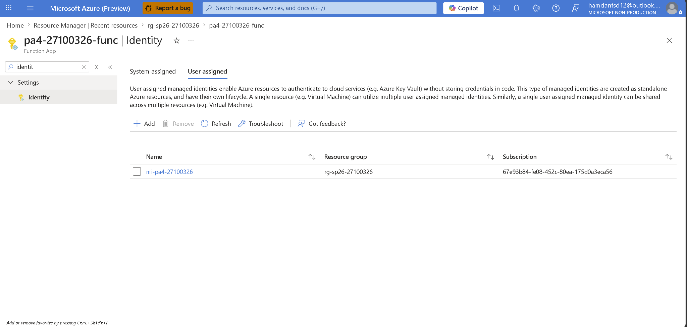

Description: Function App `pa4-27100326-func` → Identity blade → **User assigned** tab shows managed identity `mi-pa4-27100326` attached (resource group `rg-sp26-27100326`). This identity holds the Contributor role on the resource group so the Function can call `az container create` to spawn ACIs from `report-job:v1`. *(IAM role-assignment screenshot was not captured in the docx — please add the Access Control (IAM) → Role assignments view of `rg-sp26-27100326` showing `mi-pa4-27100326` as Contributor.)*

### Evidence 6.6: Report App Settings

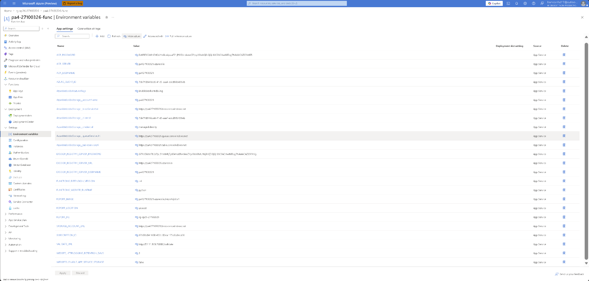

Description: Function App Environment variables blade showing the full settings list including `REPORT_*` (image, container name, command), `ACR_*` (login server, username, password — masked), `STORAGE_CONN` (storage connection string — masked), and `SUBSCRIPTION_ID`. Together these tell the orchestrator which ACR image to pull, where to push the PDF, and which subscription to create the ACI in.

---

## Task 7: End-to-End Pipeline (15 points)

### Evidence 7.1: Web App Wiring

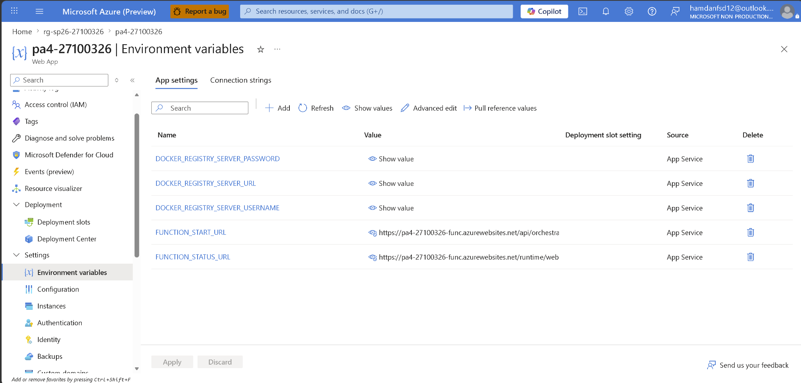

Description: Web App `pa4-27100326` Environment variables blade — `FUNCTION_START_URL = https://pa4-27100326-func.azurewebsites.net/api/orchestrators/...` and `FUNCTION_STATUS_URL = https://pa4-27100326-func.azurewebsites.net/runtime/webhooks/...`. The frontend POSTs to the start URL on submit and polls the status URL for completion.

### Evidence 7.2: Happy Path UI

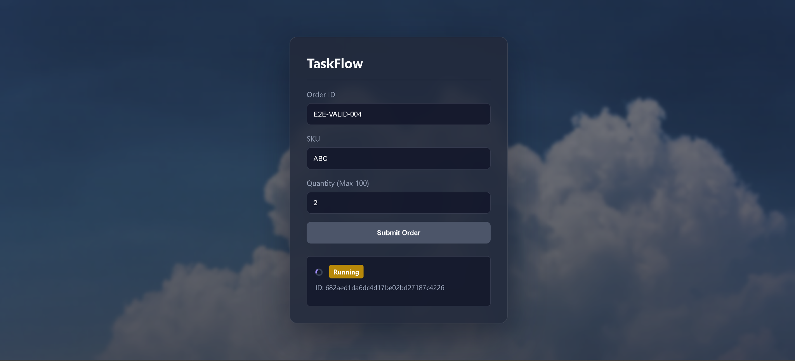

Description: TaskFlow form submitted with Order ID `E2E-VALID-004`, SKU `ABC`, Quantity `2`. The status pill underneath shows **Running** with an orchestration instance ID — the Web App has successfully started the Durable orchestration.

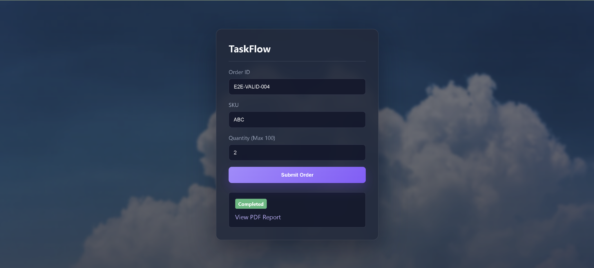

Description: Same order moments later — status pill now reads **Completed** and a **View PDF Report** button is rendered. The orchestration finished validate → report end-to-end.

Description: Clicking "View PDF Report" opens the SAS URL `pa427100326.blob.core.windows.net/reports/E2E-VALID-004.pdf` directly from Blob Storage — the report ACI wrote the artifact and the orchestrator returned its URL.

### Evidence 7.3: Backend Participation

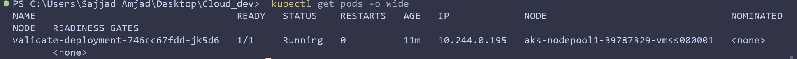

Description: `kubectl get pods -o wide` taken during the E2E test — `validate-deployment-746ccc37fdd-jk5d6` is **1/1 Running** on the same nodepool VM, IP `10.244.0.195`. Proves the Function App reached the AKS validator for `E2E-VALID-004`.

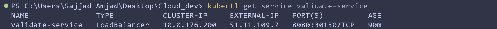

Description: `kubectl get service validate-service` confirms the same EXTERNAL-IP `51.11.109.7:8080:30150/TCP` configured in `VALIDATE_URL` is the endpoint the orchestrator hit during the E2E run.

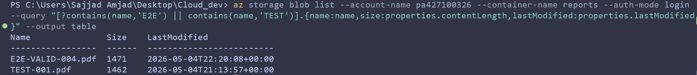

Description: `az storage blob list --account-name pa427100326 --container-name reports --query "[?contains(name,'E2E') || contains(name,'TEST')].{name:name,size:properties.contentLength,lastModified:properties.lastModified}"` returns `E2E-VALID-004.pdf` (1471 bytes) alongside `TEST-001.pdf`. The new blob's lastModified timestamp matches the orchestration completion time, proving the same order ID flowed Web App → Function → AKS → ACI → Blob.

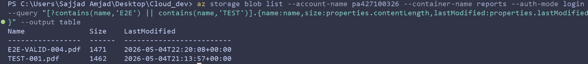

Description: Repeat of the blob listing taken slightly later, again showing `E2E-VALID-004.pdf` and `TEST-001.pdf` — included as a second timestamp anchor for the same order ID.

### Evidence 7.4: Reject Path UI

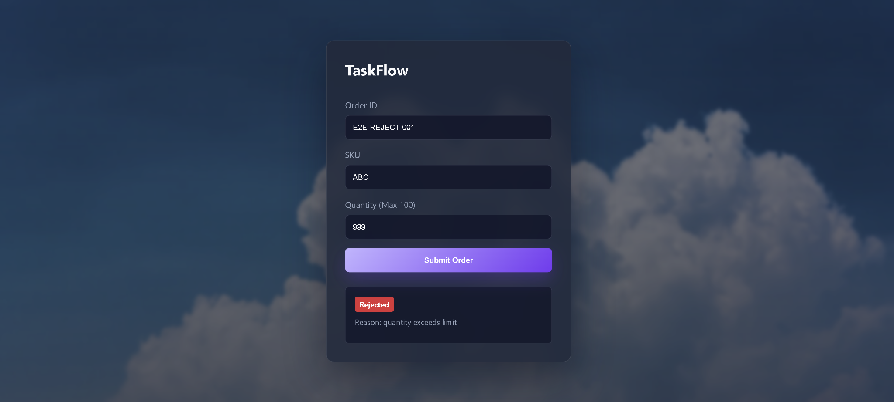

Description: TaskFlow form submitted with Order ID `E2E-REJECT-001`, SKU `ABC`, Quantity **300** (above the 100 limit). The UI shows a **Rejected** pill and the message "Reason: quantity exceeds limit". No report ACI is created because the orchestrator short-circuits when validation returns `valid:false`.

---

## Task 8: Write-up and Architecture Diagram (5 points)

### Evidence 8.1: Architecture Diagram

TODO: Embed your architecture diagram from `docs/`.

Description: TODO: Confirm that it shows GitHub, App Service, Durable Function, AKS, ACI, Blob Storage, ACR, and IAM. *(Not captured in the original docx — please add the architecture diagram here.)*

### Question 8.2: Service Selection

TODO: In 3-4 sentences each, explain why TaskFlow uses App Service, Durable Functions, AKS, and ACI for their specific roles.

### Question 8.3: ACI vs AKS

TODO: Compare idle behavior, cost behavior, and operational model for AKS and ACI using your screenshots.

> Helpful evidence captured during this work — reference these when answering 8.3:

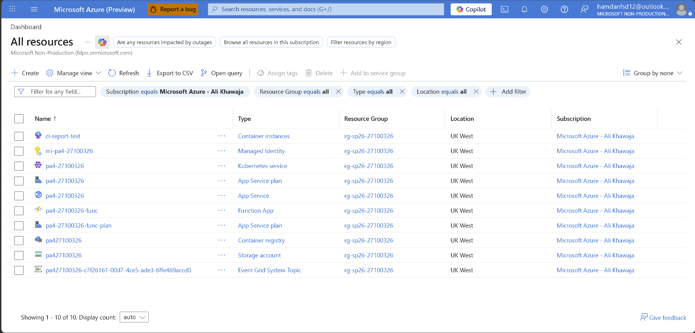

Description: All resources in `rg-sp26-27100326` — `ci-report-test` (Container Instances) appears alongside long-lived resources like `pa4-27100326` (App Service), `pa4-27100326-func` (Function App), AKS, ACR, and Storage. The ACI is ephemeral while AKS and the others are continuously billed.

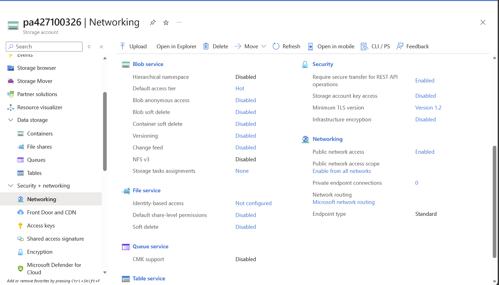

Description: Storage account `pa427100326` Networking blade — public network access enabled, Hot access tier — the storage account that backs both the AzureWebJobsStorage for Durable Functions state and the `reports` container for ACI uploads.

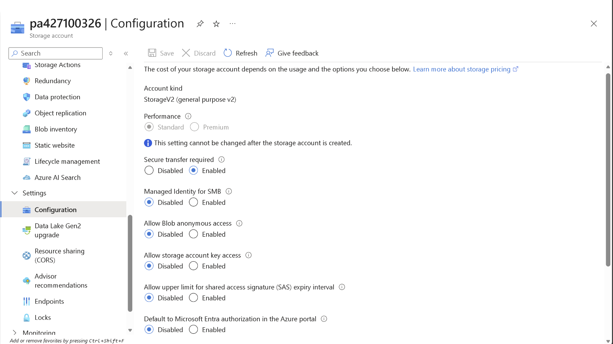

Description: Storage account `pa427100326` Configuration blade — StorageV2 (general purpose v2), Standard performance, secure transfer required.

### Question 8.4: Durable Functions vs Plain HTTP

TODO: Explain at least two problems that Durable Functions solves for this sequential workflow.

### Question 8.5: Cost Review

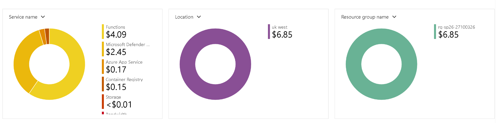

Description: Cost analysis scoped to `rg-sp26-27100326`. The single largest line item is **Functions ($4.09)** — the Function App on a dedicated plan (Linux, B1) accounts for roughly 60% of spend because it runs 24/7 to host the Durable orchestrator. **Microsoft Defender for Cloud ($2.45)** is the next contributor (subscription-level security plan), followed by **App Service ($0.17)** and **Container Registry ($0.15)**. Storage is **<$0.01**. All spend is in **UK West** under `rg-sp26-27100326`. Total $6.85.

### Question 8.6: Challenges Faced

TODO: Describe at least two real issues you hit and how you debugged them.

> Additional supporting evidence:

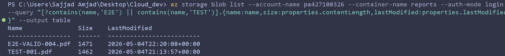

Description: Final state of `reports` container — `E2E-VALID-004.pdf` and `TEST-001.pdf` only. Useful for reasoning about cost (only successful orders incur ACI + storage cost).

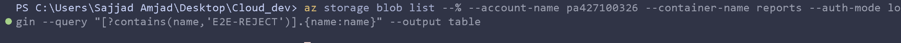

Description: `az storage blob list ... --query "[?contains(name,'E2E-REJECT')].{name:name}"` returns an empty result set, proving the rejected order from 7.4 never produced a report (no ACI was created), which directly supports the cost-saving argument for Durable Functions short-circuiting on validation failures.

---
